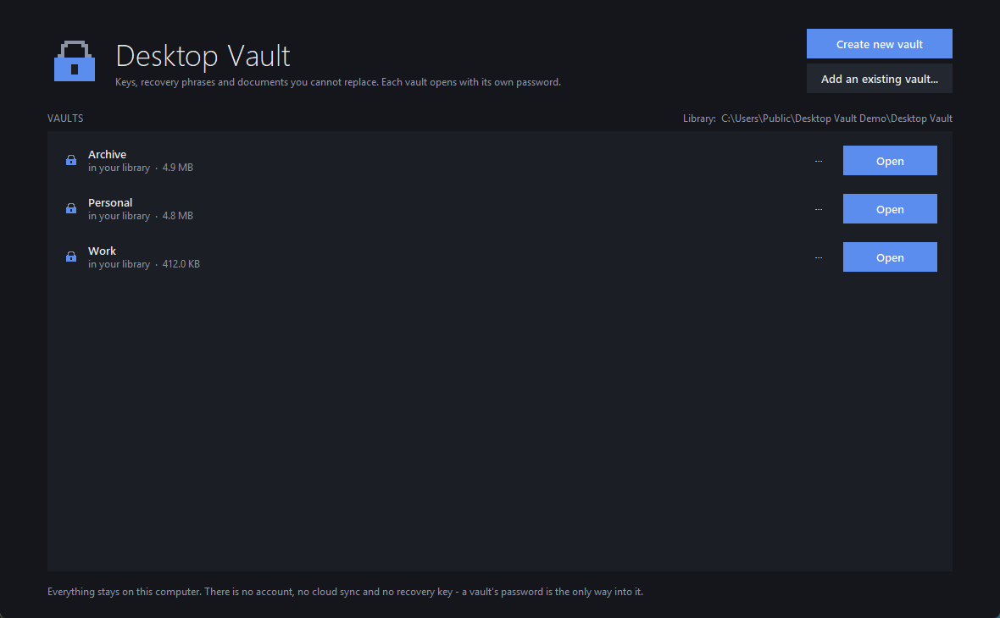
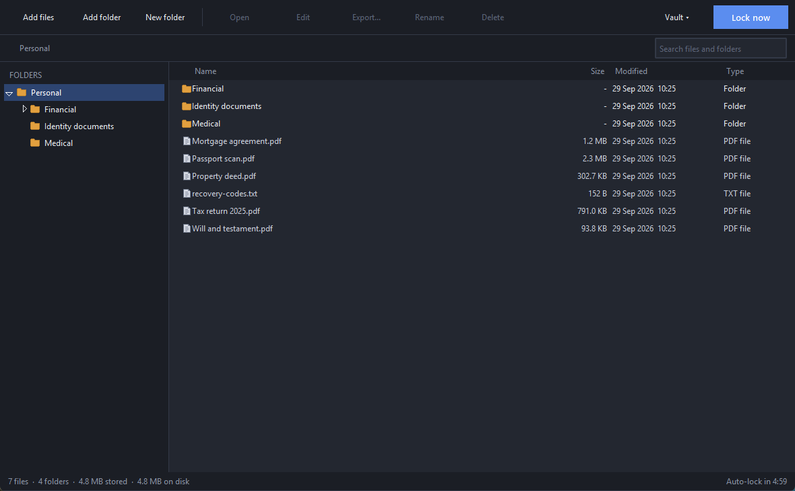
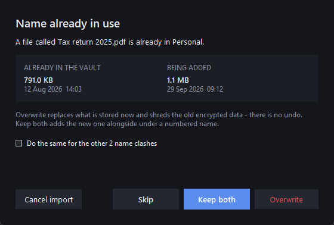
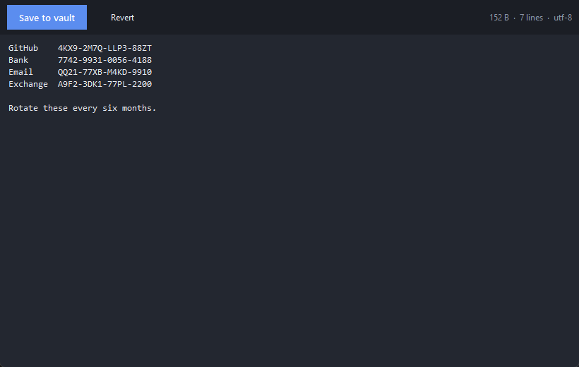

# Desktop Vault

**An offline, encrypted vault for the secrets that unlock everything else.**

API keys, webhook URLs, secret keys and access tokens. Crypto wallet recovery
phrases and seed words. Two-factor backup codes. And the documents you cannot
replace if they leak — tax returns, passport and ID scans, contracts, medical
records, wills, property deeds.

These are the things that end up scattered across a Notes app, a spreadsheet
called `keys.xlsx`, a screenshot in Downloads, or a folder synced to somebody
else's cloud. Desktop Vault gives them one encrypted place on your own machine,
protected by a single password.

There is no account, no cloud, no telemetry and **no recovery path** — without
the password the contents are unreadable, by you or by anyone else.





---

## What it's for

| | |
| --- | --- |
| **Developer secrets** | API keys, webhook URLs, signing keys, `.env` files, SSH keys, service-account JSON, database credentials |
| **Crypto** | Recovery phrases, seed words, private keys, exchange backup codes |
| **Account recovery** | Two-factor backup codes, recovery kits, password-manager emergency sheets |
| **Identity** | Passport and driving licence scans, birth certificates, visas, national ID |
| **Financial and legal** | Tax returns, bank statements, contracts, wills, property deeds, insurance policies |
| **Medical** | Test results, prescriptions, records, insurance paperwork |

Short secrets — keys, phrases, codes — are best kept as text files and opened
with **Edit**, which decrypts them into memory only and never writes plaintext
to disk. Scans and documents go in as files.

---

## Requirements

| | |
| --- | --- |
| Windows | 10 or 11 (any recent build; the dark title bar needs 10 v1809+) |
| Python | 3.9.2 or newer, with Tkinter — the standard python.org installer includes it |

Nothing else. No account, no network access, no background service.

## Running it

```bat
python -m pip install -r requirements.txt
```

Then double-click **`Desktop Vault.bat`** (or `DesktopVault.pyw`).

`Create desktop shortcut.bat` puts a properly-iconed shortcut on your desktop.
`build_exe.bat` packages everything into a single `dist\Desktop Vault.exe` that
runs on machines without Python.

Requires Python 3.9+ with Tkinter (included in the standard python.org
installer for Windows).

---

## Using it

| Task | How |
| --- | --- |
| Make a vault | *Create new vault* → pick a name and a password |
| Put things in | Drag files or folders onto the window, or *Add files* / *Add folder* |
| Read a file | Select it and press *Open* (or double-click) |
| Edit a text file | *Edit* — opens in the app, `Ctrl+S` saves back |
| Save an open document | *Save changes* in the toolbar — **not** automatic, see below |
| Get a copy out | Select and press *Export…* — writes **unencrypted** copies |
| Lock up | *Lock now*, `Ctrl+L`, or wait for the idle timer |
| Switch vaults | *Vault ▾ → Switch to → ‹name›*, or *Lock and show all vaults* |
| Change password | *Vault ▾ → Change password…* — instant, whatever the size |
| Check nothing rotted | *Vault ▾ → Check vault integrity* |
| See the crypto in use | *Vault ▾ → About this vault* |

Shortcuts: `Ctrl+L` lock · `Ctrl+F` search · `F5` refresh · `F2` rename ·
`Delete` delete · `Backspace` go up · `Ctrl+A` select all.

### One icon, many vaults

The app is the only thing that needs to be on your desktop. Opening it shows
your **vault library** — every vault, listed by name, none of them open. Each
one has its own password and is unlocked separately, so the library itself
holds nothing secret and needs no password of its own.

New vaults are created in the library folder, which defaults to:

```
%USERPROFILE%\Documents\Desktop Vault
```

Change it under *Vault ▾ → Settings…*. Pointing the library somewhere else
does not move any existing vault; it only changes where new ones go and which
folder is scanned for the list.

You do not have to close the app to move between vaults. From inside an open
vault, *Vault ▾ → **Switch to*** lists every other vault you have; picking one
locks the current vault and takes you straight to that vault's password prompt.
*Vault ▾ → **Lock and show all vaults*** does the same but returns you to the
library list instead. Either way the current vault is locked first, and if a
document is still open with unsaved changes you get the usual prompt —
cancelling it leaves everything exactly as it was.

A vault kept anywhere else still works. **Add an existing vault…** opens a
folder picker: choose the folder whose name ends in `.locker` and it is added
to the list straight away, then takes you to its password prompt. It stays
listed whether or not you unlock it right then, showing its full path instead
of *in your library*. Point it at a folder that *contains* vaults — an easy
mistake, or a deliberate one after restoring a backup — and it offers to add
all of them at once.

Nothing is copied or altered: the app only records where the vault is. Use
*⋯ → Remove from this list* to unlist it (the vault itself stays put), or
*⋯ → Move into my library* to bring it in for real. Moving relocates the
encrypted files as they are: nothing is decrypted and no password is asked for.
On the same drive it is an instant rename; across drives the copy is verified
before the original is removed.

A vault is an ordinary folder named `YourName.locker`. Back it up by copying
that folder anywhere you like — the copy is just as encrypted as the original.

### Working with files

**Drag and drop.** Drop files or folders straight onto the file list, or onto
a folder in the sidebar to put them there. This needs `tkinterdnd2`; without
it the *Add files* / *Add folder* buttons do the same job.

**Name clashes.** Adding something whose name is already in the folder stops
and asks: **Overwrite** (replaces the stored copy and shreds the old encrypted
data), **Keep both** (adds it as `name (2)`), or **Skip**. Overwriting a folder
replaces the whole subtree. You are asked before anything is written, so
*Cancel import* really does leave the vault untouched, and a tickbox applies
one answer to the rest of a batch.



**Editing text in the app.** Text files (`.txt`, `.md`, `.csv`, `.json`,
config and source files) open in a built-in editor. The bytes are decrypted
into memory, edited, and re-encrypted straight back — **no plaintext is ever
written to disk**, so there is nothing to shred afterwards. `Ctrl+S` saves.
*Vault ▾ → New text file* creates one from scratch.



**Everything else is handed to Windows, and changes do not come back on their
own.** The app decrypts a temporary working copy and launches whatever program
Windows associates with the file. Saving in that program writes to the
temporary copy, not to the vault. The change only reaches the vault when you
return to Desktop Vault and press **Save changes** in the toolbar, or confirm
the prompt when you lock. A warning says so before each external open; it can
be turned off in Settings.

Treat that route as best-effort. Some programs -- Office especially -- can
defeat it by saving to a different location, holding the file open, or writing
after the vault has closed, and the save will look successful in that program
while the vault never sees it. **If a document matters, use *Export…*, edit the
exported copy, then add it back.** Text files avoid the problem entirely: open
them with *Edit* and they never leave the vault.

The working copy is shredded when you lock or quit. The idle auto-lock will not
fire while a document is still open elsewhere -- shredding a file another
program has open is exactly how an edit gets silently lost -- so the status bar
shows *Auto-lock held* instead, and anything already saved is captured.

### Why the vault is a folder you can still open

Explorer will happily open a vault folder, because it *is* a directory. What
you find inside is `vault.json` (parameters and a wrapped key, no secrets),
`index.enc` (your file and folder names, encrypted) and `data/` full of
randomly-named blobs. None of your filenames or content are there in the clear.

Because a plain manila folder is a misleading thing to look at, the app marks
each vault with a padlock icon and a "contents are encrypted" tooltip. Keeping
vaults in the library means you rarely see the folder at all. If you do want a
vault on the desktop, that is still available from *Vault ▾*:

| Menu item | What it does |
| --- | --- |
| *Put a shortcut on the Desktop* | Creates `YourName.lnk` that opens the password prompt |
| *Hide the vault folder in Explorer* | Sets the Hidden attribute; toggles back from the same menu |

Both are cosmetic. Hiding a folder is not a security measure — anything that
goes looking will still find it, which is exactly why the contents are
encrypted regardless.

**Check vault integrity** decrypts every file in place, discarding the
plaintext as it goes, and re-checks each authentication tag against the stored
SHA-256. It tells you a vault is still sound without exporting anything. It
also reports blobs the index no longer references, and index entries whose
data has gone missing.

The app accepts a vault path on the command line, so shortcuts can open a
specific vault straight at its password prompt:

```bat
pythonw DesktopVault.pyw "D:\Vaults\Personal.locker"
```

---

## How the protection works

**Password → key.** Your password goes through **Argon2id**, a memory-hard key
derivation function, using 256 MiB of memory and a pass count calibrated on
your machine at creation time (~0.8 s per attempt). Memory-hardness is what
makes GPU and ASIC guessing expensive rather than cheap.

**Key → master key.** Argon2id produces a key-encryption key that unwraps a
random 256-bit master key stored in `vault.json`. Changing your password only
re-wraps that master key, so it is instant regardless of vault size. The wrap
is authenticated with the header as associated data, so an attacker cannot
weaken the stored Argon2 parameters to make cracking cheaper — the self-test
verifies this.

**Master key → everything else.** HKDF-SHA256 derives separate purpose-bound
sub-keys, so the index and the file blobs never share key material.

**File contents.** Each file gets its own random 256-bit key and is encrypted
in 1 MiB chunks with **AES-256-GCM**. Every chunk's associated data binds the
vault id, the blob id, the chunk number and an end-of-stream flag, which makes
truncation, reordering and splicing chunks between files all detectable rather
than silently decryptable.

**Names and structure.** File names, folder layout, sizes and timestamps live
only in `index.enc`, which is itself AES-256-GCM encrypted. On disk the blobs
carry random 128-bit names. Plaintext is zero-padded to a 4 KiB boundary so
small files do not advertise their exact length.

### What a vault folder looks like

```
Personal.locker/
├── vault.json        format, Argon2 parameters, salt, wrapped master key
├── index.enc         encrypted: all names, folders, sizes, per-file keys
├── index.enc.bak     previous index, so a crash mid-write is survivable
└── data/
    └── 3a/3a9f…c1.blob    encrypted contents, random name
```

Someone who copies the folder without the password learns only that a vault
exists, roughly how much data it holds and how many files are in it.

---

## Verify it yourself

Don't take the description on trust:

```bat
python self_test.py
```

102 checks run against throwaway vaults: round-trips including empty,
multi-chunk and nested content; confirmation that no file name or plaintext
byte appears anywhere on disk; rejection of wrong passwords, flipped bits,
truncated blobs and downgraded KDF parameters; password rotation; working-copy
handling and the ACL on the workspace; shredding on delete; the integrity
checker catching both corruption and missing data; in-memory editing including
line endings surviving a round trip; moving vaults between folders without
losing or overwriting anything; and a live pass that builds every dialog and
runs the whole create-a-vault flow, imports by drag-and-drop, edits a file in
the editor, switches between vaults, resolves name clashes every way the
prompt offers, and confirms the idle auto-lock never shreds a document another
program still has open.

---

## Where it protects you, and where it doesn't

> **This has not been independently audited.** It is built from standard,
> well-regarded primitives used in the ordinary way — Argon2id, AES-256-GCM,
> HKDF, all via [`cryptography`](https://cryptography.io) and
> [`argon2-cffi`](https://github.com/hynek/argon2-cffi) rather than anything
> hand-rolled — and the self-test checks the properties claimed below. That is
> not the same as review by a professional cryptographer. Judge it accordingly.

Encryption only covers some threats honestly. Here is the real boundary.

**It does protect against** someone who gets the vault folder — a stolen or
lost laptop, a backup drive, a synced cloud copy, a second user account on the
same machine, or anyone who copies the files off the disk. Without the password
they have authenticated ciphertext and nothing else. Tampering is detected, not
silently decrypted. That covers your question about AI too: any program, agent
or person reading those files sees only ciphertext. The key exists nowhere but
in your head and, briefly, in this app's memory while unlocked.

**It does not protect against** these, and no file-encryption tool does:

- **Malware or a keylogger on the machine.** Anything that can watch you type
  captures the password, and anything running as you can read memory while the
  vault is unlocked. Encryption at rest cannot fix a compromised host.
- **The unlocked window.** While a vault is open its master key is in RAM and
  its contents are one click away. That is what the idle auto-lock, *Lock now*
  and the lock-on-minimise option are for. Lock it when you step away.
- **Opened working copies.** Opening a document has to write plaintext where
  another program can read it. Those copies go to a folder under
  `%LOCALAPPDATA%\DesktopVault\open` whose ACL is stripped to your account
  alone, are tracked while open, and are overwritten and deleted when the vault
  locks or the app exits. But while a file is open in Word or a PDF reader, it
  is a normal file, and that program may make its own autosave copies.
- **Shredding on an SSD.** Deleted blobs are overwritten before unlinking,
  which defeats undelete tools. Wear levelling means the original cells may
  survive anyway. Treat it as good hygiene, not forensic erasure.
- **Exports.** *Export…* deliberately produces ordinary unprotected files. The
  app asks for confirmation; after that they are your responsibility.
- **A weak password.** Argon2id makes each guess expensive, not impossible.
  A short or common password is still the weakest link. Several unrelated words
  beat a short string of symbols.
- **Losing the password.** There is no reset, no backup key and no support
  line. This is a deliberate design property, not an oversight, and it is the
  same property that makes the first guarantee true.

---

## Project layout

```
DesktopVault.pyw       launcher (dependency check + crash reporting)
self_test.py          the verification suite described above
vaultlib/
  crypto.py           Argon2id, HKDF, AES-256-GCM, chunked stream cipher
  store.py            vault container, encrypted index, blob storage, shredding
  session.py          settings and the locked-down working-copy workspace
  strength.py         offline password-strength estimator
  theme.py            dark ttk theme and shared widgets
  icons.py            icons drawn in code — no binary assets
  editor.py           in-app text editor; plaintext never reaches the disk
  shell.py            Windows folder icon and Desktop shortcut (cosmetic only)
  dialogs.py          modal dialogs and the threaded progress runner
  ui.py               screens: start, unlock, create, browser
```

No network code is imported anywhere in `vaultlib`.
